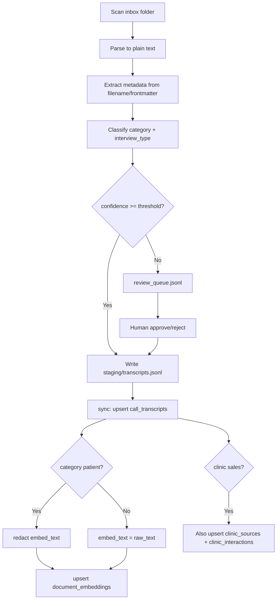

# Data Ingestion Plans

**Created:** 2026-07-03  
**Status:** Active — implementation plans for all planned ingestion lanes  
**Companion:** [`DATA_SOURCES_CATALOG.md`](DATA_SOURCES_CATALOG.md) (what sources exist) · [`MASTER_PLAN.md`](MASTER_PLAN.md) (platform rollout)

---

## Executive summary

| Plan | Sources | Priority | Complexity | Blocker |
|------|---------|----------|------------|---------|
| **P0** Shared ingestion infrastructure | All | P0 | M | None |
| **P1** Transcript & meeting import | A4, B5, B6, C2, E2 | P1 | L | P0 |
| **P2** Clinic sales Gmail | A3 | P1 | M | P0, Gmail OAuth for clinic account |
| **P3** Practitioner Gmail sync + embed | B4 | P1 | M | P0, existing doctor Gmail OAuth |
| **P4** Clinic sales CSV seed | A6 | P2 | S | None |
| **P5** WhatsApp patient conversations | C1 | P3 | L | **Privacy review** |
| **P6** Patient voice bank → Supabase | C3 | P3 | M | P5 privacy model |
| **P7** TikTok interview metadata backfill | D7 | P2 | S | None |
| **P8** Doctify clinic reviews | A7 | P4 | M | Playwright worker |
| **P9** Scheduled agent syncs | B3, E1 | P2 | S | P0 |

**Recommended build order:** P0 → P1 + P4 (parallel) → P2 + P3 → P7 + P9 → P5 → P6 → P8

---

## Design principles (all plans)

1. **Metadata first, embed second** — upsert domain table row before writing chunks to `document_embeddings`.
2. **Idempotent** — stable external IDs + `content_hash`; safe to re-run.
3. **Log every run** — `data_ingestion_runs` via `start_run` / `finish_run`.
4. **Sensitivity before search** — set `document_embeddings.sensitivity` at embed time; MCP uses `max_sensitivity`.
5. **No raw PII in vectors** — redact names, emails, phones, NHS numbers before embedding patient content.
6. **Human gates** — classification `unknown`, patient content, and clinic observations stay blocked until approved.
7. **Reuse existing code** — Python embeddings/chunking from `data-worker/common/`; Gmail from `Doctors Sales Agent/outreach_agent/gmail_client.py`.

---

## P0 — Shared ingestion infrastructure

**Goal:** One folder layout, one staging format, shared Python modules so every lane looks like TikTok/marketing-pipeline.

### Deliverables

| Item | Path | Purpose |
|------|------|---------|
| Import drop zones | `data/imports/` (gitignored) | Raw exports per source |
| Staging JSONL | `data/staging/*.jsonl` (gitignored) | Normalized records awaiting Supabase |
| Review queue CSV/JSONL | `data/staging/review_queue.jsonl` | Human classification backlog |
| Shared package | `ingestion-pipeline/` or `data-worker/ingestion/` | Parsers, classify, redact, sync |
| CLI root | `python -m ingestion_pipeline` | Unified entrypoint |
| Env vars | `.env.example` additions | Paths, Gmail accounts, review thresholds |

### Folder layout

```text
data/
  imports/                          # gitignored — drop raw files here
    emails/
      clinic/                         # P2: .eml exports or Gmail sync cache
      practitioner/                   # P3
    transcripts/
      inbox/                          # P1: unclassified drops
      patient/                        # optional pre-sort
      practitioner/
      clinic/
      internal/
    whatsapp/                         # symlinks or copies of Total conversation exports
  staging/                            # gitignored — normalized JSONL
    transcripts.jsonl
    email_threads.jsonl
    patient_conversations.jsonl
    review_queue.jsonl
  cache/                              # gitignored — Gmail API pagination, etc.
```

### Staging record schema (common envelope)

Every staged object uses the same wrapper so one sync runner can dispatch:

```json
{
  "lane": "transcript",
  "source_system": "google_drive",
  "source_id": "sha256-of-path-or-file-id",
  "content_hash": "sha256-of-normalized-text",
  "sensitivity": "confidential",
  "metadata": {
    "classification_confidence": 0.85,
    "interview_type": "clinic_sales_call",
    "clinic_account_id": null,
    "practitioner_id": null
  },
  "source_title": "Discovery call — Example Clinic",
  "source_url": "https://drive.google.com/...",
  "occurred_at": "2026-03-15T10:00:00Z",
  "participants": ["Jack", "Clinic GM"],
  "raw_text": "...",
  "embed_text": "... redacted version for vectors ..."
}
```

### Shared modules

```text
ingestion-pipeline/
  pyproject.toml
  src/ingestion_pipeline/
    __main__.py
    cli.py
    config.py
    shared/
      supabase_client.py      # thin wrapper or import from data-worker
      embeddings.py           # re-export data-worker/common/embeddings.py
      ingestion_log.py
      hashing.py
      chunking.py
      redact.py               # NEW: PII patterns for patient lanes
      classify.py             # NEW: rules + optional LLM for transcripts
    lanes/
      transcripts/
      emails_clinic/
      emails_practitioner/
      whatsapp_patient/
      clinic_csv/
    sync/
      call_transcripts.py
      email_threads.py
      clinic_sources.py
      patient_conversations.py
```

**Alternative (smaller diff):** put modules under `data-worker/ingestion/` and CLI under `scripts/ingest-*.py`. Prefer **`ingestion-pipeline/` package** if more than 3 lanes — matches `marketing-pipeline` convention.

### CLI skeleton

```bash
python -m ingestion_pipeline scan transcripts --inbox data/imports/transcripts/inbox
python -m ingestion_pipeline classify transcripts [--auto-approve-threshold 0.9]
python -m ingestion_pipeline review list|approve|reject
python -m ingestion_pipeline sync transcripts|emails-clinic|emails-practitioner|whatsapp-patient|clinic-csv
python -m ingestion_pipeline sync all --dry-run
```

### Acceptance criteria

- [ ] `data/imports/` and `data/staging/` documented in `.gitignore`
- [ ] Staging envelope validates with Pydantic model
- [ ] `sync --dry-run` prints row counts without writing
- [ ] All lanes log to `data_ingestion_runs`

### Tasks

| ID | Task | Est. |
|----|------|------|
| P0-1 | Create folder layout + `.gitignore` entries | 1h |
| P0-2 | Scaffold `ingestion-pipeline` package with `config.py` (paths from env) | 2h |
| P0-3 | Implement staging read/write (JSONL append + dedupe by `source_id`) | 2h |
| P0-4 | Implement `shared/redact.py` (regex + optional LLM pass) | 3h |
| P0-5 | Implement `shared/classify.py` (rules first) | 3h |
| P0-6 | Implement `review` subcommands (list/approve → moves from review_queue) | 2h |
| P0-7 | Wire `ingestion_log` + Supabase client (copy from data-worker) | 1h |

---

## P1 — Transcript & meeting import (unified)

**Sources:** A4 (clinic meetings), B5 (practitioner interviews), B6 (practitioner meetings), C2 (patient interviews), E2 (internal meetings)

**Goal:** Drop `.txt`, `.vtt`, `.srt`, `.docx`, or `.md` files → classify → link entities → upsert `call_transcripts` + optional `clinic_sources` → embed.

### Pipeline stages



### Input formats

| Format | Parser | Notes |
|--------|--------|-------|
| `.txt` / `.md` | read as UTF-8 | Optional YAML frontmatter (`---` block) |
| `.vtt` / `.srt` | strip timestamps | Whisper exports |
| `.docx` | `python-docx` | Meeting notes |
| Audio (`.mp3`, `.m4a`) | Whisper via OpenRouter or local | Optional `[media]` extra; defer if no ffmpeg |

### Filename / frontmatter conventions

Encourage consistent drops:

```text
2026-03-15_clinic_example-gynaecology_discovery.txt
2026-04-02_practitioner_liz-bruen_endometriosis-interview.txt
2026-05-10_patient_user-research_session-03.txt   # → restricted
```

Frontmatter (optional):

```yaml
---
title: Discovery call — Example Gynaecology
occurred_at: 2026-03-15T10:00:00Z
participants: [Jack Ye, Sarah Smith]
category: clinic
interview_type: clinic_sales_call
clinic_account_id: uuid-or-null
practitioner_id: null
---
```

### Classification rules (`shared/classify.py` v1)

| Signal | Suggested category | `interview_type` |
|--------|-------------------|------------------|
| Path contains `/patient/` or filename `_patient_` | `patient` | `patient_interview` |
| Path contains `/practitioner/` or `_practitioner_` | `content` | `practitioner_interview` |
| Path contains `/clinic/` or `_clinic_` | `clinic` | `clinic_sales_call` |
| Path contains `/internal/` | `internal` | `team_meeting` |
| Title contains "interview" + known practitioner name match | `content` | `practitioner_interview` |
| No match | `unknown` | — → review queue |

Optional LLM pass (OpenRouter): send first 500 chars + filename → JSON `{category, interview_type, confidence}`.

**Threshold:** default `0.85` for auto-approve; else review queue.

### Supabase writes

**Primary:** `call_transcripts`

```python
{
  "source_system": "local_import",  # or google_drive
  "source_id": content_hash_or_file_id,
  "title": "...",
  "category": "clinic|patient|content|internal|unknown",
  "occurred_at": "...",
  "participants": [...],
  "source_url": null,
  "source_hash": content_hash,
  "metadata": {
    "interview_type": "clinic_sales_call",
    "classification_confidence": 0.92,
    "import_path": "data/imports/...",
    "clinic_account_id": "uuid",
    "practitioner_id": null
  }
}
```

**Secondary (clinic only):** `clinic_sources` + `clinic_interactions`

- `clinic_sources.type = 'meeting_note'`
- `clinic_sources.raw_text` = full transcript (confidential, not returned by MCP wholesale)
- `clinic_interactions.type = 'meeting_note'`, `body` = summary or first 2k chars

### Embeddings

| Category | `entity_type` | `sensitivity` | Text embedded |
|----------|---------------|---------------|---------------|
| `clinic` | `call_transcript` + optional `clinic_account` | confidential | Full transcript chunks |
| `content` | `practitioner_interview` | internal | Full transcript |
| `patient` | `patient_interview` | **restricted** | **Redacted** only |
| `internal` | `internal_meeting` | internal | Full transcript |
| `unknown` | — | — | **Do not embed** |

Link embeddings: `metadata.clinic_account_id` / `practitioner_id` on each chunk row.

### Entity linking

| Type | Link strategy |
|------|---------------|
| Clinic | Match `clinic_accounts.name` fuzzy or manual `clinic_account_id` in frontmatter |
| Practitioner | Match `integrated_practitioner_with_phin` by name from title/participants |
| Patient | **No entity link** — tags only in metadata |

### Files to create

| File | Role |
|------|------|
| `ingestion-pipeline/src/ingestion_pipeline/lanes/transcripts/scan.py` | Walk inbox, hash files |
| `.../parse.py` | Format parsers |
| `.../stage.py` | Build staging envelope |
| `ingestion-pipeline/src/ingestion_pipeline/sync/call_transcripts.py` | Supabase upsert + embed |
| `ingestion-pipeline/src/ingestion_pipeline/sync/clinic_sources.py` | Clinic branch |
| `scripts/ingest-transcripts.py` | CLI shim |
| `data-worker/jobs/transcripts.py` | Optional cron: scan + sync approved only |

### Maintenance

| Trigger | Action |
|---------|--------|
| New file in inbox | Daily cron or manual `scan` + `classify` |
| Re-drop same file (hash unchanged) | Skip |
| Re-drop changed file | Update row, re-embed if `embed_text` hash changed |
| Misclassified | `review reject` → re-drop or manual SQL fix + re-embed |

### Acceptance criteria

- [ ] 3 sample files (clinic, practitioner, patient) ingest end-to-end
- [ ] Patient file embeds with redaction (spot-check: no emails/phones in `document_embeddings.content`)
- [ ] `unknown` file appears in review queue, not embedded until approved
- [ ] Clinic file creates `call_transcripts` + `clinic_sources` linked to account
- [ ] `search_knowledge(entity_type=practitioner_interview)` returns cited chunk
- [ ] Run logged in `data_ingestion_runs` as `transcript_import`

### Tasks

| ID | Task | Est. | Depends |
|----|------|------|---------|
| P1-1 | Parsers: txt, md, vtt, srt | 3h | P0 |
| P1-2 | Frontmatter + filename metadata extraction | 2h | P0 |
| P1-3 | Classification rules + review queue integration | 4h | P0-5, P0-6 |
| P1-4 | `sync/call_transcripts.py` + embeddings | 4h | P0 |
| P1-5 | Clinic branch (`clinic_sources`, interactions) | 3h | P1-4 |
| P1-6 | Practitioner name matcher | 2h | P1-4 |
| P1-7 | Patient redaction in embed path | 2h | P0-4 |
| P1-8 | CLI + docs + sample fixtures in `ingestion-pipeline/tests/` | 3h | P1-1–7 |

---

## P2 — Clinic sales Gmail (A3)

**Goal:** Incrementally sync clinic-facing Gmail threads into `email_threads` + `clinic_sources`, embed redacted chunks for Ask DocMap / `get_clinic_briefing`.

### Prerequisites

- Gmail OAuth with `gmail.readonly` for **clinic sales mailbox** (may differ from doctor outreach mailbox)
- Env: `GMAIL_CLINIC_CREDENTIALS_PATH`, `GMAIL_CLINIC_TOKEN_PATH` (or reuse pattern from doctor agent)
- Label or query filter: e.g. `-label:spam`, `after:2024/01/01`, optional `@clinic-domain` heuristics

### Pipeline stages

```
1. List threads (paginated, store page tokens in data/cache/gmail_clinic.json)
2. For each thread: fetch messages, parse plain text body
3. Match to clinic_account:
   a. By participant domain → clinic_accounts.website_url domain
   b. By manual mapping file data/staging/clinic_email_aliases.json
   c. Else metadata.unmatched = true → review queue
4. Upsert email_threads (gmail_thread_id unique)
5. Upsert clinic_sources (type=email_thread, clinic_account_id, raw_text=concat messages)
6. Upsert clinic_interactions (type=email_thread, summary)
7. Embed chunks: entity_type=clinic_email, sensitivity=confidential
   - Strip quoted reply chains beyond 2 levels (reduce noise)
   - Do not embed signatures/legal footers (heuristic)
```

### `email_threads.metadata` extensions

```json
{
  "purpose": "clinic_sales",
  "clinic_account_id": "uuid",
  "match_method": "domain|alias|manual",
  "sync_account": "jack@docmap.co.uk"
}
```

### Matching logic

| Priority | Rule |
|----------|------|
| 1 | External participant email domain matches `clinic_accounts.website_url` registrable domain |
| 2 | Alias map: `sales@exampleclinic.co.uk` → `clinic_account_id` |
| 3 | Subject contains clinic name (fuzzy ≥ 90) |
| 4 | Unmatched → review queue; do not link to account until approved |

### Files to create

| File | Role |
|------|------|
| `ingestion-pipeline/lanes/emails_clinic/fetch.py` | Gmail list/get (adapt from `gmail_client.py`) |
| `.../parse.py` | MIME → plain text |
| `.../match_clinic.py` | Domain + fuzzy name |
| `sync/email_threads.py` | Upsert + clinic_sources branch |
| `data-worker/jobs/gmail_clinic.py` | Cron job |
| `scripts/ingest-gmail-clinic.py` | CLI |

### Maintenance

| Schedule | Action |
|----------|--------|
| Daily 04:00 UTC | Incremental sync (`after:last_sync`) |
| On demand | `--thread-id` single thread backfill |
| Token refresh | OAuth refresh via google-auth |

### Acceptance criteria

- [ ] 10+ historical clinic threads ingested with correct `clinic_account_id`
- [ ] Unmatched threads in review queue, not orphaned into wrong account
- [ ] `get_clinic_briefing(clinic_account_id)` can surface email-derived observations (manual verify)
- [ ] `search_knowledge(entity_type=clinic_email)` returns snippets, not full thread
- [ ] Job `gmail_clinic_sync` in `data_ingestion_runs`

### Tasks

| ID | Task | Est. | Depends |
|----|------|------|---------|
| P2-1 | Extract reusable Gmail fetch from doctor agent | 3h | P0 |
| P2-2 | Clinic domain matcher + alias file | 3h | P0 |
| P2-3 | `email_threads` + `clinic_sources` sync | 4h | P2-1 |
| P2-4 | Embed pipeline with reply trimming | 2h | P2-3 |
| P2-5 | Review queue for unmatched | 2h | P0-6 |
| P2-6 | Cron + CLI + env docs | 2h | P2-3 |

---

## P3 — Practitioner Gmail sync + embed (B4)

**Goal:** Extend existing doctor outreach Gmail sync to write `email_threads` + embeddings, not only local `email_history.json`.

### What exists today

- `Doctors Sales Agent/outreach_agent/gmail_client.py` — OAuth, drafts, readonly
- `outreach_agent sync` — matches sent/replies to history
- `sync_whatsapp_and_history_to_supabase.py` — pushes outreach **state**, not email bodies

### Pipeline stages

```
1. Reuse gmail_client.get_gmail_service()
2. For each doctor_outreach row with canonical_email:
   - Search messages to/from email (existing sync lookback)
   - Upsert email_threads with metadata.purpose = practitioner_outreach
   - metadata.practitioner_id = doctor_outreach.practitioner_id
3. Embed: entity_type=practitioner_email, sensitivity=confidential
4. Optional: embed subject lines + first paragraph only for sent outreach (lower token cost)
5. Do NOT embed full threads for unrelated personal email
```

### Scope guardrails

- Only threads where participant matches `doctor_outreach.canonical_email` or draft intent headers
- Max `GMAIL_SYNC_MAX_MESSAGES_PER_DOCTOR` (existing config: 15)
- Skip threads already embedded with same `content_hash`

### Files to create

| File | Role |
|------|------|
| `ingestion-pipeline/lanes/emails_practitioner/fetch.py` | Wrap existing sync discovery |
| `sync/practitioner_emails.py` | Upsert + embed |
| Extend `sync_whatsapp_and_history_to_supabase.py` | Call embed step post-sync (or separate job) |
| `data-worker/jobs/gmail_practitioner.py` | Weekly cron |

### Acceptance criteria

- [ ] Practitioner with sent outreach has `email_threads` row(s)
- [ ] `search_knowledge(entity_type=practitioner_email)` returns cited snippets
- [ ] `get_practitioner_status` unchanged; optional enrichment with last email subject
- [ ] Idempotent re-run

### Tasks

| ID | Task | Est. | Depends |
|----|------|------|---------|
| P3-1 | Map history.json threads → email_threads schema | 3h | P0 |
| P3-2 | Embed practitioner email chunks | 2h | P3-1 |
| P3-3 | Integrate with weekly doctor sync cron (E1) | 2h | P3-2 |
| P3-4 | Tests with mocked Gmail payloads | 2h | P3-1 |

---

## P4 — Clinic sales CSV seed (A6)

**Goal:** Import `Clinic sales agent/output/clinic_sales_results.csv` into `clinic_accounts` (+ optional contacts), embed summary fields.

### Pipeline stages

```
1. Parse CSV (pandas — same patterns as content_tracker.py)
2. For each row:
   - Match existing clinic_accounts by website_url or name fuzzy
   - Upsert: name, website_url, pipeline_stage, fit_score, sales_angle, next_action
   - Optional: create clinic_contacts from CSV email/name columns
3. Embed: entity_type=clinic_account, content = structured summary paragraph
4. Do NOT overwrite manual edits: use metadata.import_source = clinic_sales_csv
   - Skip update if account.updated_at > import file mtime (optional flag)
```

### Column mapping (adjust after inspecting CSV)

| CSV column (expected) | `clinic_accounts` field |
|-----------------------|-------------------------|
| Clinic name | `name` |
| Website | `website_url` |
| Stage / status | `pipeline_stage` |
| Notes / angle | `sales_angle` |
| Contact email | `clinic_contacts.email` |

### Files to create

| File | Role |
|------|------|
| `ingestion-pipeline/lanes/clinic_csv/parse.py` | CSV → staging |
| `sync/clinic_accounts.py` | Upsert accounts + embed |
| `scripts/ingest-clinic-sales-csv.py` | CLI |

### Acceptance criteria

- [ ] CSV rows visible in Next.js `/accounts`
- [ ] Re-import does not duplicate accounts (website_url unique index)
- [ ] `search_knowledge(entity_type=clinic_account)` finds imported clinics

### Tasks

| ID | Task | Est. | Depends |
|----|------|------|---------|
| P4-1 | Inspect CSV columns + document mapping in plan | 1h | — |
| P4-2 | Implement parse + upsert | 3h | P0 |
| P4-3 | Embed summary chunks | 1h | P4-2 |
| P4-4 | CLI one-shot + MASTER_PLAN E2 checkbox | 1h | P4-2 |

---

## P5 — WhatsApp patient conversations (C1)

**Goal:** Parse **patient-side** messages from WhatsApp exports into `patient_conversations` with tags; embed **redacted** chunks only.

**Blocker:** Privacy review sign-off (see checklist below).

### Difference from B3 (existing)

| | B3 (live) | C5 (this plan) |
|---|-----------|----------------|
| Parser | `extract_recommendations()` — operator blocks only | Full thread parser — patient messages |
| Table | `doctor_recommendation_events` | `patient_conversations` |
| Sensitivity | confidential | **restricted** |
| Embed | optional / minimal | redacted chunks only |

### Pipeline stages

```
1. Reuse whatsapp_conversations.load_conversation() for JSON/txt
2. Split messages by sender: patient vs operator vs system
3. Aggregate per conversation file → one patient_conversations row:
   - source_id = file stem
   - conversation_date = min message date
   - message_count = patient messages only
   - contains_pii = true
4. Tag extraction (keyword rules from patient_voice.py + optional LLM):
   - condition_tags, need_tags
5. redact.py on patient message text → embed_text
6. Upsert patient_conversations (no raw text in table — only tags + counts)
7. Store raw export path in metadata.import_path (not in Supabase body)
8. Embed entity_type=patient_conversation, sensitivity=restricted
```

### Privacy review checklist (gate before merge)

- [ ] Legal/compliance sign-off on storing WhatsApp exports
- [ ] Redaction rules verified on 10 sample conversations
- [ ] MCP `max_sensitivity=confidential` excludes `restricted` by default (verify `match_documents`)
- [ ] Ask DocMap `/api/chat` uses same sensitivity ceiling
- [ ] No patient names in `document_embeddings.metadata`
- [ ] Retention period defined (e.g. 24 months)

### Files to create

| File | Role |
|------|------|
| `ingestion-pipeline/lanes/whatsapp_patient/parse.py` | Full thread parser |
| `.../tag.py` | condition_tags, need_tags |
| `sync/patient_conversations.py` | Upsert + embed |
| `scripts/ingest-whatsapp-patient.py` | CLI |

### Acceptance criteria

- [ ] Privacy checklist complete
- [ ] `get_patient_demand_patterns` returns non-empty `top_conditions` / `top_needs`
- [ ] `search_knowledge(entity_type=patient_conversation)` blocked at default MCP sensitivity OR returns only redacted snippets
- [ ] Spot audit: 0 raw phone numbers in embeddings

### Tasks

| ID | Task | Est. | Depends |
|----|------|------|---------|
| P5-0 | Privacy review meeting + document decision | ext. | — |
| P5-1 | Patient message parser (not operator recos) | 4h | P0 |
| P5-2 | Tag extraction (reuse Carousel keywords) | 3h | P5-1 |
| P5-3 | Redaction + embed | 3h | P0-4 |
| P5-4 | Sync + verify MCP sensitivity | 2h | P5-3 |

---

## P6 — Patient voice bank → Supabase (C3)

**Goal:** Port `Carousel agents V2` JSONL banks to `patient_conversations` / embeddings after P5 privacy model is approved.

### Pipeline

```
1. Read patient_voice_messages.jsonl + patient_voice_snippets.jsonl
2. Map snippets → patient_conversations-like rows OR new entity_type patient_voice_snippet
3. Embed snippets (already short; may skip redaction if pre-reviewed)
4. MCP: search_knowledge(entity_type=patient_voice_snippet) for carousel/Marketing only
```

**Defer implementation details until P5 redaction rules are canonical.**

### Tasks

| ID | Task | Est. | Depends |
|----|------|------|---------|
| P6-1 | Schema decision: extend patient_conversations vs snippet entity_type | 2h | P5 |
| P6-2 | JSONL import script | 3h | P6-1 |
| P6-3 | Wire Carousel agents to read from Supabase (optional) | 4h | P6-2 |

---

## P7 — TikTok interview metadata backfill (D7)

**Goal:** Tag existing `content_posts` where transcript is a practitioner interview; link to `practitioner_id` when name matches.

### Pipeline

```
1. Read tiktok_marketing_dataset.json / content_posts
2. Heuristic: format_guess, hook patterns, title contains "interview", build_analysis interview_qa
3. Optional LLM batch: "Is this a clinician interview?" yes/no
4. PATCH content_posts.metadata.interview_type = practitioner_interview
5. PATCH metadata.practitioner_name / practitioner_id if matched
6. Re-embed tiktok_transcript chunks with updated metadata (skip if hash unchanged)
```

### Files to create

| File | Role |
|------|------|
| `marketing-pipeline/.../stages/tag_interviews.py` OR `scripts/backfill-tiktok-interviews.py` | One-shot + optional refresh stage |

### Acceptance criteria

- [ ] Liz Bruen–type videos tagged `practitioner_interview`
- [ ] `search_knowledge` can filter by metadata (or entity_type if split)

### Tasks

| ID | Task | Est. | Depends |
|----|------|------|---------|
| P7-1 | Rule-based tagger on dataset | 2h | — |
| P7-2 | Practitioner name matcher | 2h | P7-1 |
| P7-3 | metadata PATCH + conditional re-embed | 2h | P7-2 |

---

## P8 — Doctify clinic reviews (A7)

**Goal:** On-demand scrape → `clinic_sources` (type=`website_page` or new `review` type) → observations.

### Prerequisites

- Playwright worker running (`worker/handlers/doctify-scrape.ts` exists)
- Trigger via API job per `clinic_account_id`

### Pipeline

```
1. Job: DOCTIFY_SCRAPE with clinic Doctify URL
2. Store raw HTML/text in clinic_sources
3. LLM extract: rating themes, pain points → clinic_observations (review_status=draft)
4. Embed approved observations only
```

**Defer until F2 Playwright worker deployed or run locally.**

### Tasks

| ID | Task | Est. | Depends |
|----|------|------|---------|
| P8-1 | Verify doctify-scrape handler output schema | 2h | — |
| P8-2 | Map to clinic_sources + LLM extract | 4h | P8-1 |
| P8-3 | UI trigger on account detail (optional) | 4h | P8-2 |

---

## P9 — Scheduled agent syncs (E1)

**Goal:** Wire existing scripts into `data-worker` cron.

### Jobs to schedule

| Job name | Script / module | Schedule | Notes |
|----------|-----------------|----------|-------|
| `whatsapp_doctor_sync` | `Doctors Sales Agent/scripts/sync_whatsapp_and_history_to_supabase.py` | Weekly Sun 02:00 UTC | B3 state |
| `gmail_practitioner_embed` | P3 lane | After whatsapp sync | B4 embed |
| `transcript_inbox_scan` | P1 scan + classify | Daily 01:00 UTC | Auto-approve high confidence |
| `gmail_clinic_sync` | P2 lane | Daily 04:00 UTC | A3 |

### `data-worker/main.py` changes

```python
# Add env flags:
# ENABLE_GMAIL_CLINIC=1
# ENABLE_GMAIL_PRACTITIONER=1
# ENABLE_WHATSAPP_SYNC=1
# ENABLE_TRANSCRIPT_SCAN=1
```

Prod default (per MASTER_PLAN): TikTok only — enable others when Railway secrets ready.

### Tasks

| ID | Task | Est. | Depends |
|----|------|------|---------|
| P9-1 | Subprocess wrappers for doctor sync script | 1h | — |
| P9-2 | Register cron jobs with env flags | 2h | P2, P3, P1 |
| P9-3 | Update `docs/mcp_runbook.md` | 1h | P9-2 |

---

## Schema changes (minimal)

**v1 uses existing tables.** Defer `sql/005` unless query pain arises.

| Need | Approach |
|------|----------|
| Clinic email → account link | `email_threads.metadata.clinic_account_id` |
| Practitioner email link | `email_threads.metadata.practitioner_id` |
| Interview subtype | `call_transcripts.metadata.interview_type` |
| Unmatched imports | `data/staging/review_queue.jsonl` (file-based queue v1) |

**Optional `sql/005_data_ingestion.sql` (later):**

```sql
-- review_queue table if file-based queue outgrows spreadsheets
CREATE TABLE IF NOT EXISTS ingestion_review_queue (
  id UUID PRIMARY KEY DEFAULT gen_random_uuid(),
  lane TEXT NOT NULL,
  source_system TEXT NOT NULL,
  source_id TEXT NOT NULL,
  suggested_category TEXT,
  suggested_metadata JSONB NOT NULL DEFAULT '{}',
  status TEXT NOT NULL DEFAULT 'pending'
    CHECK (status IN ('pending','approved','rejected')),
  reviewed_by TEXT,
  reviewed_at TIMESTAMPTZ,
  created_at TIMESTAMPTZ NOT NULL DEFAULT now()
);
```

---

## MCP & app consumers (per lane)

| Lane | MCP / app consumer | Query pattern |
|------|-------------------|---------------|
| P1 clinic transcript | `get_clinic_briefing`, Ask DocMap | `entity_type=call_transcript`, filter metadata |
| P1 practitioner interview | `search_knowledge`, TikTok briefing | `entity_type=practitioner_interview` |
| P2 clinic email | `get_clinic_briefing` | `entity_type=clinic_email` |
| P3 practitioner email | `get_practitioner_status`, draft tool | `entity_type=practitioner_email` |
| P4 clinic CSV | Next.js accounts, Ask DocMap | `entity_type=clinic_account` |
| P5 WhatsApp patient | `get_patient_demand_patterns` | Tags in table; restricted embed optional |
| P7 TikTok interviews | `get_tiktok_content_briefing` | `metadata.interview_type` |

**New MCP tools (optional, post-ingestion):**

- `search_transcripts(category, since, query)` — thin wrapper over `search_knowledge`
- `list_unmatched_imports()` — reads review queue (admin)

---

## Testing strategy

| Level | What |
|-------|------|
| Unit | Parsers, classify rules, redact patterns |
| Integration | Supabase upsert against local/dev project with `--dry-run` |
| Fixtures | `ingestion-pipeline/tests/fixtures/` — sample txt, vtt, WhatsApp JSON |
| Privacy | Manual audit script: `scripts/audit-embeddings-pii.py` grep for email/phone/NHS patterns |
| Idempotency | Run sync twice → `rows_inserted=0` second time, `rows_updated=0` |

---

## Environment variables (add to `.env.example`)

```bash
# Ingestion paths
INGESTION_IMPORTS_DIR=data/imports
INGESTION_STAGING_DIR=data/staging
INGESTION_CLASSIFY_THRESHOLD=0.85

# Gmail — clinic sales (P2)
GMAIL_CLINIC_CREDENTIALS_PATH=
GMAIL_CLINIC_TOKEN_PATH=
GMAIL_CLINIC_QUERY=after:2024/01/01 -label:spam

# Gmail — practitioner (P3) — may alias existing doctor agent paths
# GOOGLE_CREDENTIALS_PATH=  (existing)

# WhatsApp patient (P5) — after privacy review
WHATSAPP_PATIENT_CONVERSATIONS_DIR=data/imports/whatsapp

# Clinic CSV (P4)
CLINIC_SALES_CSV_PATH=Clinic sales agent/output/clinic_sales_results.csv

# Feature flags (data-worker)
ENABLE_GMAIL_CLINIC=0
ENABLE_GMAIL_PRACTITIONER=0
ENABLE_WHATSAPP_PATIENT=0
ENABLE_TRANSCRIPT_SCAN=0
```

---

## Master task board

Copy to issue tracker as needed.

| Phase | Plans | Total est. | Target |
|-------|-------|------------|--------|
| Foundation | P0 | ~14h | Week 1 |
| High value | P1, P2, P3, P4 | ~45h | Weeks 2–3 |
| Enrichment | P7, P9 | ~8h | Week 3 |
| Privacy gated | P5, P6 | ~20h+ | After review |
| Deferred | P8 | ~10h | With Playwright worker |

---

## Document maintenance

When shipping a lane:

1. Check off tasks in this doc
2. Update status in [`DATA_SOURCES_CATALOG.md`](DATA_SOURCES_CATALOG.md)
3. Update [`STATUS.md`](../STATUS.md)
4. Add runbook section to [`docs/mcp_runbook.md`](mcp_runbook.md)
