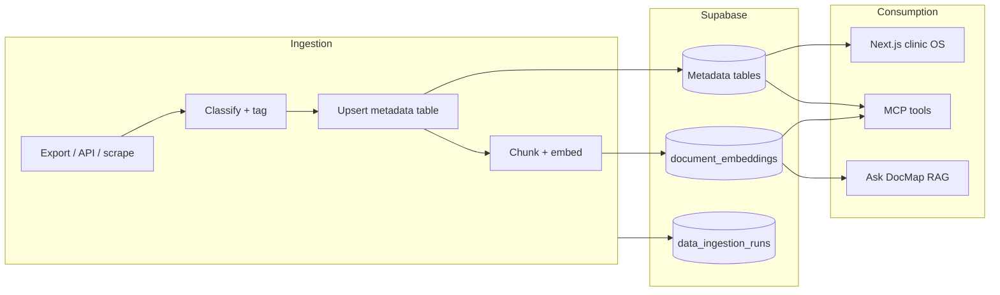

# Data Sources Catalog

**Created:** 2026-07-03  
**Status:** Active — living registry of intelligence sources for DocMap Intelligence OS  
**Related:** [`DATA_INGESTION_PLANS.md`](DATA_INGESTION_PLANS.md) (how to build each lane) · [`MCP_PLAN.md`](../MCP_PLAN.md) · [`MCP_IMPLEMENTATION_GUIDE.md`](MCP_IMPLEMENTATION_GUIDE.md) · [`sql/004_mcp_sources.sql`](../sql/004_mcp_sources.sql)

---

## Purpose

This document catalogs every data source we want available in Intelligence OS: what exists today, what is planned, how each source is stored, extracted, maintained, and how sources combine for product and MCP use.

Update this file when adding a lane, changing sensitivity rules, or shipping ingestion.

---

## What already exists in the repo

There is **no single database table** that lists all sources. Instead, the repo uses a **repeatable three-layer pattern**:

| Layer | Where | Role |
|-------|-------|------|
| **Metadata row** | Supabase table per domain (`email_threads`, `call_transcripts`, `clinic_sources`, …) | Identity, dates, participants, tags, hashes, links |
| **Raw content** | On-disk export, object storage, or `raw_text` column | Full transcript/email/conversation (often not embedded wholesale) |
| **Search index** | `document_embeddings` | Short cited chunks with `entity_type`, `source_table`, `sensitivity`, `metadata` |

Operational tracking: `data_ingestion_runs` (every job), `mcp_tool_audit_log` (every MCP call).

Shared ingestion utilities:

- Python: `data-worker/common/embeddings.py`, `marketing-pipeline/src/marketing_pipeline/shared/embeddings.py`
- TypeScript: `worker/handlers/embed-document.ts`
- Chunking + hashing: `common/chunking.py`, `common/hashing.py`

**Privacy rule (locked):** MCP and Ask DocMap return **short cited snippets only** — never full email threads, patient chats, or raw transcripts. See `MCP_PLAN.md`.

---

## Architecture: how every source should fit



**Idempotency contract (all lanes):**

1. Stable external ID → `(source_system, source_id)` or domain-specific key (`gmail_thread_id`, `platform_post_id`)
2. Content hash → skip re-embed if unchanged
3. Log every run to `data_ingestion_runs`

---

## Source catalogue

Status key: **Live** = ingested to Supabase · **Partial** = parsed locally, not fully in Supabase · **Schema** = table exists, no ingestion · **Planned** = not built · **Defer** = explicit later phase

### A. Clinic sales & engagement

| ID | Source | Status | Sensitivity | Metadata storage | Embedding `entity_type` | On-disk / origin | Extraction | Maintenance |
|----|--------|--------|-------------|------------------|-------------------------|------------------|------------|-------------|
| A1 | **Clinic website pages** | Live (app) | internal | `clinic_sources` (`website_page`) | `clinic_account`, `observation` | Submitted URL via research job | Playwright fetch → cheerio/readability → LLM extract (`worker/handlers/website-research.ts`, `llm-extract.ts`) | Re-run research when URL changes; hash dedup on `content_hash` |
| A2 | **Clinic manual notes** | Live (app) | internal | `clinic_sources` (`manual_note`) | `observation` | UI / API | Direct text entry | Manual edit |
| A3 | **Clinic email threads (sales)** | Schema | confidential | `clinic_sources` (`email_thread`) + optionally `email_threads` | `clinic_email`, `clinic_interaction` | Gmail (clinic-facing accounts) | Gmail API read → thread parse → link to `clinic_account_id` | Incremental sync by `last_message_at`; label/filter by clinic domain |
| A4 | **Clinic meeting notes / call transcripts** | Schema | confidential | `clinic_sources` (`meeting_note`) + `call_transcripts` (`category=clinic`) | `call_transcript`, `clinic_interaction` | Google Drive, Notion, manual upload | Doc/text import; optional Whisper if audio | Classify at ingest; human review for `unknown` |
| A5 | **Clinic interactions log** | Live (app) | internal | `clinic_interactions` | — (structured log; embed optional) | App UI | Manual + system events | Append-only |
| A6 | **Clinic sales CSV** | Partial | internal | `clinic_accounts` (seed/enrich) | `clinic_account` | `Clinic sales agent/output/clinic_sales_results.csv` | One-time or periodic CSV import (`MASTER_PLAN` E2) | Re-import when CSV refreshed |
| A7 | **Doctify / clinic reviews** | Planned | internal | TBD (`clinic_sources` or new table) | `clinic_review` | Doctify scrape (`worker/handlers/doctify-scrape.ts`) | Playwright scrape | On-demand job per clinic |
| A8 | **Negative review analysis** | Partial | internal | Not in Supabase | — | `Negative Review analysis/` | Separate analysis script | Manual |

**Primary consumers:** Next.js accounts/research/outreach, `get_clinic_briefing`, Ask DocMap (`entity_type=clinic_account`), future `draft_outreach_email` (clinic variant).

---

### B. Practitioner / doctor outreach

| ID | Source | Status | Sensitivity | Metadata storage | Embedding `entity_type` | On-disk / origin | Extraction | Maintenance |
|----|--------|--------|-------------|------------------|-------------------------|------------------|------------|-------------|
| B1 | **Integrated practitioner registry** | Live | internal | `integrated_practitioner_with_phin` | `practitioner` | `Doctors Sales Agent/data/…json` + Supabase | Upload script | Periodic refresh from PHIN/GMC enrichment |
| B2 | **Doctor outreach state** | Live | internal | `doctor_outreach` | — | Derived from history + WhatsApp | `sync_whatsapp_and_history_to_supabase.py` | Run after WhatsApp/history sync |
| B3 | **WhatsApp recommendation events** | Live | confidential | `doctor_recommendation_events` | `recommendation_event` (optional) | `Doctors Sales Agent/data/whatsapp convo/Total conversation/` | `whatsapp_conversations.py` — operator messages only | Re-parse on new export files |
| B4 | **Doctor sales Gmail (outbound/inbound)** | Partial | confidential | Local `email_history.json`; target `email_threads` | `practitioner_email` | Gmail via `Doctors Sales Agent/outreach_agent/gmail_client.py` | Sync matches drafts/sent/replies | `outreach_agent sync`; not yet full Supabase embed |
| B5 | **Practitioner interview transcripts** | Planned | internal | `call_transcripts` (`category=content` or new `practitioner`) | `practitioner_interview` | Drive, Riverside, Zoom exports | Same pipeline as B6; **classifier → practitioner** | See § Interview classification |
| B6 | **Practitioner meeting transcripts (non-interview)** | Planned | internal | `call_transcripts` | `call_transcript` | Internal ops calls | Import + classify | Lower priority |

**Primary consumers:** `search_practitioners`, `get_practitioner_status`, `Doctors Sales Agent` draft CLI, MCP `draft_outreach_email`, marketing (clinician quotes for content).

---

### C. Patient voice & demand

| ID | Source | Status | Sensitivity | Metadata storage | Embedding `entity_type` | On-disk / origin | Extraction | Maintenance |
|----|--------|--------|-------------|------------------|-------------------------|------------------|------------|-------------|
| C1 | **WhatsApp patient conversations (full)** | Partial | **restricted** | Target: `patient_conversations` | `patient_conversation` (redacted chunks) | Same folder as B3 — **patient messages**, not operator recos | Parse all messages; **PII redaction before embed**; tag `condition_tags`, `need_tags` | Privacy review required (`MCP_PLAN` Step 2) |
| C2 | **Patient interview transcripts** | Planned | **restricted** | `call_transcripts` (`category=patient`) | `patient_interview` | Drive / recording exports | Transcribe (Whisper) → classify → redact → embed | Human confirms `category=patient` |
| C3 | **Patient voice bank (carousel)** | Partial | confidential | Local JSONL only | — | `Carousel agents V2/` → `patient_voice_*.jsonl` | `patient_voice.py` keyword tagging | Port to Supabase after C1 privacy model approved |
| C4 | **Synthetic hypothetical patients** | Partial | internal | Local JSONL | — | `Doctors Sales Agent/data/hypothetical_patients.jsonl` | LLM from practitioner bio | Cache by prompt version; not for MCP until reviewed |
| C5 | **TikTok comments (audience voice)** | Live | public | `content_posts.metadata` + digest file | `tiktok_comment_batch`, `marketing_comment_digest` | `marketing-pipeline/tiktok/data/` | `refresh-comments` → compile → sync | Weekly cron |

**Primary consumers:** `get_patient_demand_patterns` (metadata tags today), TikTok angle suggestions, carousel ideation, content strategy MCP tools.

**Important distinction:** B3 currently extracts **operator recommendation blocks** from WhatsApp. C1 is the **full patient thread** for demand insight — different extraction, different sensitivity, same raw export folder.

---

### D. Marketing & content

| ID | Source | Status | Sensitivity | Metadata storage | Embedding `entity_type` | On-disk / origin | Extraction | Maintenance |
|----|--------|--------|-------------|------------------|-------------------------|------------------|------------|-------------|
| D1 | **TikTok videos** | Live | public | `content_posts` | `content_post`, `tiktok_transcript` | `marketing-pipeline/tiktok/data/` | `marketing_pipeline tiktok export/sync-supabase` | Daily comments; weekly full refresh |
| D2 | **TikTok on-screen hooks (OCR)** | Live | public | `content_posts.metadata` | (in `content_post` chunks) | `tiktok/data/ocr/` | Vision LLM on ffmpeg frames | Re-run `ocr-hooks` on new videos |
| D3 | **TikTok comments** | Live | public | export files + embeddings | `tiktok_comment_batch`, `marketing_comment_digest` | `ALL_COMMENTS.txt` | `refresh-comments` | Cron |
| D4 | **Marketing playbooks / strategy docs** | Live | internal | filesystem + embeddings | `marketing_playbook` | `tiktok/data/playbooks/` | `import-playbooks`, `sync-playbooks` | Manual add; sync embeds |
| D5 | **Instagram content tracker** | Partial | public | `content_posts` (`platform=instagram`) | `content_post` | CSV via `scripts/ingest-content-tracker.py` | CSV parse | Dev/local; fresh API fetch planned (Phase C) |
| D6 | **Instagram carousel source docs** | Defer | internal | Not in Supabase | — | `Carousel agents V2/documents/` | Carousel pipeline ingest | After Phase F (`MASTER_PLAN`) |
| D7 | **Content interview videos (TikTok)** | Live | public | Part of D1 | `tiktok_transcript` | Same as TikTok | Transcript + stats | Some videos are practitioner interviews — tag in `metadata.interview_type` |

**Primary consumers:** `get_content_performance`, `get_tiktok_marketing_insights`, `get_tiktok_content_briefing`, `find_ab_tests`, `suggest_next_tiktok_angles`.

---

### E. Operations & market intelligence

| ID | Source | Status | Sensitivity | Metadata storage | Embedding `entity_type` | On-disk / origin | Extraction | Maintenance |
|----|--------|--------|-------------|------------------|-------------------------|------------------|------------|-------------|
| E1 | **HCA appointment slots** | Partial (dev) | internal | `appointment_slots`, `booking_guids` | — (structured) | `Appointment utilization rate/hca-monitor/data/hca_monitor.db` | `scripts/ingest-hca-sqlite.py` | Deferred in prod (`MASTER_PLAN`) |
| E2 | **Internal meeting transcripts** | Schema | internal | `call_transcripts` (`category=internal`) | `internal_meeting` | Drive | Import | Low priority |
| E3 | **MCP audit / ingestion health** | Live | internal | `mcp_tool_audit_log`, `data_ingestion_runs` | — | Generated | Automatic | Retention policy TBD |

**Primary consumers:** `get_appointment_availability`, `get_weekly_briefing`.

---

## Interview & transcript classification

Many transcripts share the same file format but serve different purposes. **Classify at ingest** before embedding.

### Recommended taxonomy

Store on `call_transcripts.category` (existing) **plus** `metadata.interview_type` for finer grain:

| `category` | `metadata.interview_type` | Examples | Default sensitivity |
|------------|---------------------------|----------|---------------------|
| `patient` | `patient_interview` | User research, symptom journey | **restricted** |
| `clinic` | `clinic_sales_call` | Sales discovery, partnership | confidential |
| `content` | `practitioner_interview` | Liz Bruen endo interview for TikTok | internal |
| `content` | `patient_story` | Published patient story (consented) | internal |
| `internal` | `team_meeting` | Standups, planning | internal |
| `unknown` | — | Awaiting human review | confidential (no embed until classified) |

### Classification workflow

```
1. Ingest file → compute source_hash, extract title/date/participants from filename or frontmatter
2. Auto-suggest class (rules + optional LLM) → write metadata.classification_confidence
3. If confidence < threshold OR category=unknown → queue for human review (UI or spreadsheet)
4. On approval → chunk + embed with correct sensitivity
5. Link related entities:
   - practitioner_interview → integrated_practitioner_with_phin.id (if matched)
   - clinic_sales_call → clinic_accounts.id
   - patient_interview → no PII in metadata; tags only
```

**Reuse:** TikTok pipeline already distinguishes interview-style hooks in analysis (`build_analysis.py`: `interview_qa`). Align naming with `metadata.interview_type`.

### Schema note (future `005` migration — only if needed)

`call_transcripts.category` CHECK currently: `internal|clinic|patient|content|unknown`. That is enough for v1. Add `practitioner` to CHECK or rely on `content` + `metadata.interview_type` to avoid migration churn.

---

## How sources work together

### 1. Clinic outreach prep

```
clinic_accounts + clinic_sources (website, emails, meetings)
  → clinic_observations (approved)
  → outreach_drafts
  → MCP get_clinic_briefing + search_knowledge(entity_type=clinic_account)
```

Emails (A3) and meeting transcripts (A4) attach to **`clinic_account_id`** via `clinic_sources`, keeping the evidence ledger model from `001_clinic_intelligence.sql`.

### 2. Practitioner onboarding email

```
WhatsApp recos (B3) + doctor_outreach (B2) + practitioner registry (B1)
  + optional practitioner interview quotes (B5)
  → Doctors Sales Agent draft / MCP draft_outreach_email
  → search_knowledge(entity_type=practitioner)
```

### 3. Content strategy (TikTok / carousel)

```
TikTok performance (D1–D3) + marketing playbooks (D4)
  + patient demand tags (C1/C5) + practitioner interview transcripts (B5/D7)
  → suggest_next_tiktok_angles, get_tiktok_content_briefing
  → Carousel agents (patient_voice snippets from C3)
```

### 4. Patient demand insight (aggregate, not raw)

```
patient_conversations tags (C1) + TikTok comment digest (C5) + patient interviews (C2, redacted)
  → get_patient_demand_patterns
  → marketing_playbook evidence drafts
```

**Cross-source rule:** Join on **tags/topics** (condition, need, specialty) and **entity links** (practitioner_id, clinic_account_id) — not on raw patient identifiers in MCP responses.

---

## Storage model summary

| Source family | Canonical metadata table | Raw body location | Embed? |
|---------------|-------------------------|-------------------|--------|
| Clinic evidence | `clinic_sources` | `raw_text` column | Yes, after approval |
| Clinic structured | `clinic_observations`, `clinic_contacts`, `clinic_interactions` | DB columns | Optional snippets |
| Email (cross-cutting) | `email_threads` | Object store or `clinic_sources.raw_text` | Redacted chunks only |
| Calls / interviews | `call_transcripts` | Drive path in `source_url`; text in staged file | Yes, after classification |
| Patient WhatsApp | `patient_conversations` | Export files (gitignored) | Redacted chunks only |
| Practitioner outreach | `doctor_outreach`, `doctor_recommendation_events` | WhatsApp JSON, Gmail | Events optional |
| Marketing | `content_posts` | `marketing-pipeline/tiktok/data/` | Yes |
| Practitioners | `integrated_practitioner_with_phin` | JSON export | Profile fields |

**Entity type registry** (for `document_embeddings.entity_type` — extend as lanes ship):

| entity_type | Source IDs | Status |
|-------------|------------|--------|
| `clinic_account` | A1, A6 | Live |
| `observation` | A1, A2 | Live |
| `practitioner` | B1 | Live |
| `recommendation_event` | B3 | Partial |
| `content_post` | D1, D5 | Live |
| `tiktok_transcript` | D1 | Live |
| `tiktok_comment_batch` | D3 | Live |
| `marketing_playbook` | D4 | Live |
| `marketing_comment_digest` | D3 | Live |
| `clinic_email` | A3 | Planned |
| `practitioner_email` | B4 | Planned |
| `call_transcript` | A4, B6, E2 | Planned |
| `patient_interview` | C2 | Planned |
| `practitioner_interview` | B5, D7 | Planned |
| `patient_conversation` | C1 | Planned (privacy) |

---

## Extraction & maintenance patterns

| Pattern | When to use | Example in repo |
|---------|-------------|-----------------|
| **Export file drop** | Bulk historical data | WhatsApp JSON, transcript txt, CSV |
| **API sync** | Ongoing Gmail, TikTok comments | `refresh-comments`, Gmail sync |
| **Scrape job** | Web content | Website research, Doctify, HCA |
| **Human-in-the-loop** | Classification, approval | `clinic_observations.review_status`, interview `unknown` queue |
| **Pipeline package** | Multi-stage media | `marketing-pipeline` CLI |
| **Cron worker** | Scheduled refresh | `data-worker/main.py` |

**Recommended folder convention for new raw exports (gitignored):**

```text
data/
  imports/
    emails/clinic/          # A3
    emails/practitioner/      # B4
    transcripts/
      patient/                # C2
      practitioner/           # B5
      clinic/                 # A4
      internal/               # E2
    whatsapp/                 # B3, C1 (same exports; different parsers)
  staging/                    # Normalized JSONL awaiting Supabase sync
```

---

## Ingestion priority (proposed)

Full implementation plans: **[`DATA_INGESTION_PLANS.md`](DATA_INGESTION_PLANS.md)** (P0–P9).

| Phase | Sources | Plans | Rationale |
|-------|---------|-------|-----------|
| **Now (done)** | D1–D4, B1–B3, A1–A2 | — | Low privacy risk; proves MCP + embeddings |
| **Next** | A3, A4, B4, A6 | P0, P1, P2, P3, P4 | High value for clinic + doctor outreach; schema exists |
| **After privacy review** | C1, C2 | P5, P6 | Restricted sensitivity; redaction pipeline required |
| **Parallel** | D7, E1 | P7, P9 | Tagging + cron wiring |
| **Defer** | A7, D6, E1 prod | P8 | Doctify needs Playwright; carousels; HCA prod mount |

---

## Open decisions (track here)

| # | Question | Options | Recommendation |
|---|----------|---------|----------------|
| 1 | Single `data_sources` registry table vs this doc + per-table metadata? | DB registry / markdown only / hybrid | **Hybrid:** this catalog + optional `data_sources` view later for UI |
| 2 | Same WhatsApp export for B3 and C1? | Two parsers, one folder | **Yes** — different parsers, different tables, different sensitivity |
| 3 | Where to store raw email bodies? | Supabase TEXT / S3 / local only | **Local or object storage**; Supabase gets metadata + redacted embeds only |
| 4 | Interview classifier | Rules / LLM / human only | **Rules + LLM suggest + human confirm** for `unknown` |
| 5 | Gmail scope for A3 vs B4 | One OAuth / separate accounts | **Separate ingestion jobs** per account purpose; same `email_threads` table with `metadata.purpose` |

---

## Checklist: adding a new source

- [ ] Assign ID in this catalog (next free letter/number)
- [ ] Confirm sensitivity (`public` → `restricted`)
- [ ] Confirm metadata table (existing or new migration)
- [ ] Define `entity_type`(s) for embeddings
- [ ] Implement idempotent ingest script or worker job
- [ ] Log to `data_ingestion_runs`
- [ ] Add MCP or app consumer (or document "embed-only for Ask DocMap")
- [ ] Update [`STATUS.md`](../STATUS.md) when lane ships

---

## Quick reference: existing vs planned ingestion code

| Source | Ingestion entrypoint |
|--------|---------------------|
| TikTok | `python -m marketing_pipeline tiktok sync-supabase` |
| Instagram CSV | `scripts/ingest-content-tracker.py`, `data-worker/jobs/content_tracker.py` |
| HCA SQLite | `scripts/ingest-hca-sqlite.py` |
| Clinic website | `npm run worker` → `WEBSITE_RESEARCH` job |
| WhatsApp → doctor events | `Doctors Sales Agent/scripts/sync_whatsapp_and_history_to_supabase.py` |
| Practitioners JSON | `Doctors Sales Agent/scripts/upload_integrated_practitioners_json_to_supabase.py` |
| Emails | Not built — reuse `Doctors Sales Agent/outreach_agent/gmail_client.py` |
| Call/meeting transcripts | Not built — schema in `004_mcp_sources.sql` |
| Patient conversations (full) | Not built — `get_patient_demand_patterns` reads empty/partial `patient_conversations` |
