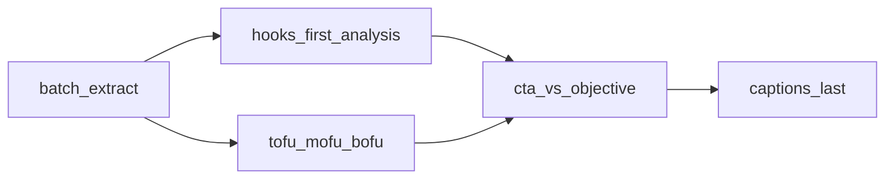

# Execution Plan: TikTok Video Component Extraction (v1)

**Status:** Implemented (v1 code) — run full-library extract + sync manually  
**Last updated:** 2026-07-10  
**Related:** [`EXECUTION_PLAN_TIKTOK_STRATEGY_AND_SYNC.md`](EXECUTION_PLAN_TIKTOK_STRATEGY_AND_SYNC.md), decision log, A/B insights, [`sql/005_tiktok_metrics.sql`](../sql/005_tiktok_metrics.sql)

## Goals

Extract structured components in a **batch pipeline** so later analysis can answer (in priority order):

1. **Hooks first** — systematic classification × retention / early performance  
2. **Funnel stage** — TOFU / MOFU / BOFU with **stage-appropriate** success metrics  
3. **CTA second** — only meaningful once intended actions are measurable  
4. **Captions last** — after hooks, topic, speaker, format, CTA are reliable  

v1 ships **extraction + sync + read/slice**. It does **not** need to ship the full analytics product yet — but the schema must **account for** the fields and metric joins those analyses will need.

## Can v1 account for the later analysis? (verdict)

| Later analysis | Accounted for in this plan? | Notes |
|----------------|----------------------------|--------|
| §4 Hooks-first systematic classification | **Yes — schema expanded** | Controlled hook-type vocabulary + attribute fields; not free-form opinions |
| Hook × 3s hold / AWT / completion / shares / velocity | **Partially now, fully when Studio/Display layers are populated** | Join at read time to `metrics` + `tiktok_studio_insights` + `content_metric_snapshots`; do not bake retention into the component card |
| §5 TOFU / MOFU / BOFU | **Yes** | Replace vague `funnel_stage_raw` with TOFU/MOFU/BOFU (+ unclear) |
| Stage-specific success metrics | **Yes — as join rules in MCP/docs**, not as stored “score” | Analyzer picks metrics by funnel stage |
| §6 CTA vs intended outcome | **Yes — CTA object expanded** | Classify now; outcome comparison waits on tracked links / conversions |
| §8 Captions last | **Yes — deferred stub** | Optional empty `caption_analysis` reserved; extract in a later phase |

**Not required in v1 product:** full hook leaderboards, CTA conversion dashboards, caption NLP.  
**Required in v1:** fields + joins so those analyses do not need a schema rewrite.

## Locked decisions

| Decision | Choice |
|----------|--------|
| Extraction owner | **Batch pipeline** (`marketing-pipeline`), not on-demand MCP |
| B-roll | **Omit** in v1 |
| Hook classification | **Systematic fields** with a **preferred type vocabulary** (closed list + `other`) — not free-form “what kind of hook is this?” essays |
| Other soft labels | Topic / speaker / format stay `*_raw` until vocabulary pass |
| Funnel | **TOFU \| MOFU \| BOFU \| unclear** (not binary TOFU/BOFU) |
| CTA | Classify structure now; **do not** claim CTA “worked” without objective metrics |
| Captions | **Last** — schema stub only in v1 extract |
| MCP role | **Read + slice + join metrics**; never extract at query time |
| Content topic vs comment theme | Keep separate under `components.topic`; do not overwrite `content_posts.topic` in v1 |

## Non-goals (v1)

- B-roll / vision scene classification  
- On-demand MCP LLM extraction  
- Full caption analysis pipeline  
- Claiming CTA → bookings without tracked conversion events  
- Hard Postgres enums / dedicated SQL table (JSONB metadata is enough)  
- Next.js UI  
- Auto-promote findings to constitution  
- Daily Railway cron for LLM extract (manual / optional weekly later)

## Analysis priority (product roadmap, not all in v1 ship)



### §4 Hooks first (highest-priority isolated variable)

Why hooks: clear time window, classifiable, tied to early retention, repeated, actionable in scripts.

**Extract systematically** (batch LLM fills structured fields; human spot-checks `needs_review`):

| Field | v1 |
|-------|-----|
| `text` | Verbatim primary hook |
| `channel` | `spoken` \| `onscreen` \| `both` \| `caption_only` |
| `type` | Preferred vocabulary (below) or `other` + `type_other` |
| `emotional_mechanism_raw` | Short phrase (fear, validation, urgency, …) — soft until clustered |
| `specificity` | `low` \| `medium` \| `high` \| `unclear` |
| `target_audience_raw` | Short phrase |
| `creates_curiosity` | bool \| null |
| `contradicts_common_belief` | bool \| null |
| `payoff_clear` | bool \| null |
| `seconds_to_main_claim` | number \| null (from segments when possible) |
| `window_sec_hint` | optional |

**Preferred `hook.type` vocabulary** (closed for classification; not free-form opinions):

- Myth correction  
- Warning  
- Direct question  
- Symptom recognition  
- Unexpected fact  
- Authority statement  
- Personal story  
- List promise  
- Outcome promise  
- Contrarian claim  
- `other` (with `type_other` text)

**Compare later against** (join at analysis time, do not store inside hook object):

| Metric | Source today |
|--------|----------------|
| 3-second hold / early retention | Studio insight when captured (`tiktok_studio_insights`) — often missing |
| Avg watch time / finish / retention rate | Studio insight layers |
| Share rate | `metrics.shares` / shares_per_1k |
| View velocity | Display API snapshots (`content_metric_snapshots`) |
| Fallback if retention missing | views, shares, early velocity — **weaker conclusions**; MCP must say so |

### §5 TOFU / MOFU / BOFU

| Stage | Content examples | Primary success metrics (join rules) |
|-------|------------------|--------------------------------------|
| **TOFU** | Symptom awareness, myths, surprising facts, broad education | Reach, watch time, shares, follower growth |
| **MOFU** | Diagnostic process, treatment comparisons, specialist explanations | Saves, comments, profile visits, repeat engagement |
| **BOFU** | Choosing clinic, consult prep, booking, named specialist/service | Link clicks, enquiries, bookings, qualified leads |

A BOFU video may look weak on views but still be commercially valuable — **analyzer must not rank all stages by views alone**.

Store: `funnel_stage`: `TOFU` \| `MOFU` \| `BOFU` \| `unclear`  
Optional: `funnel_rationale` (one short sentence).

### §6 CTA second

Classify in v1; **outcome analysis waits** on tracked links / conversion events.

| Field | v1 |
|-------|-----|
| `present` | true \| false \| unclear |
| `wording` | verbatim or null |
| `position` | `open` \| `mid` \| `end` \| `caption` \| `multiple` \| `none` |
| `channel` | `spoken` \| `onscreen` \| `caption` \| `both` \| `none` |
| `explicitness` | `explicit` \| `implicit` \| `none` \| `unclear` |
| `requested_action_raw` | e.g. follow / save / comment / link_in_bio / book |
| `value_exchange_raw` | what is offered in return (or null) |
| `urgency` | `none` \| `soft` \| `hard` \| `unclear` |
| `funnel_stage` | copy/align with video funnel when CTA implies a stage |

**Rule:** compare each CTA to its **intended** outcome (follow→followers, save→saves, comment→comments, link→clicks, book→enquiries). Do **not** score all CTAs with generic engagement rate. Until clicks/bookings exist, MCP may only report classification + proxy metrics and must flag missing conversion data.

### §8 Captions last

Do not block v1 on captions. Reserve:

```text
caption_analysis: null | {
  length_chars, keyword_coverage_raw[], form,  # question | statement | mixed
  cta_included, hashtags[], search_intent_raw,
  repeats_spoken_hook, added_context_not_in_video
}
```

v1 extract sets `caption_analysis: null`. Later phase fills it once hooks/funnel/CTA are reliable.

## Component schema (v1 extract)

**Storage:**

1. Sidecar: `marketing-pipeline/tiktok/data/analysis/video_components/{video_id}.json`  
2. Index: `.../analysis/video_components_index.json`  
3. Sync: `content_posts.metadata.components`

```text
video_id
length_sec
hook: { text, channel, type, type_other?, emotional_mechanism_raw,
        specificity, target_audience_raw, creates_curiosity,
        contradicts_common_belief, payoff_clear, seconds_to_main_claim,
        window_sec_hint? }
main_claim: { text, start_sec?, end_sec? }
supporting_explanation: { summary, start_sec?, end_sec? }
funnel_stage: TOFU | MOFU | BOFU | unclear
funnel_rationale?: string
cta: { present, wording, position, channel, explicitness,
       requested_action_raw, value_exchange_raw, urgency, funnel_stage? }
topic: { primary_raw, secondary_raw[] }
speaker: { primary_raw, type_raw }
format_raw
caption_analysis: null                  # deferred
extraction: { method, model, extracted_at, confidence, needs_review, inputs_hash }
```

**Rules:**

- Hook `type` must be from the preferred list or `other`.  
- No CTA → `present=false` (valid).  
- Missing transcript → skip + log (or stub `needs_review`).  
- Retention metrics live in Studio/Display tables — **joined at read time**, not duplicated into the card.

## Batch pipeline design

**Stage:** `marketing-pipeline/.../tiktok/stages/extract_components.py`  
**Inputs:** transcript (+ segments), existing hook detail, caption, duration, short playbook excerpt for funnel/hook hints.  
**Model:** `MODEL_COMPONENTS` (default `deepseek/deepseek-v4-flash` via OpenRouter). Vision OCR stays on `MODEL_OCR` (Gemini). Override with `deepseek/deepseek-v4-pro` if flash quality is weak.  
**CLI:** `python -m marketing_pipeline tiktok extract-components [--video-id] [--force] [--limit N]`  
**Idempotent** via `inputs_hash`. Explicit step (not daily refresh).  
**Sync:** attach `metadata.components` in `sync/supabase.py`.

## MCP surface (read-only)

| Tool | Purpose |
|------|---------|
| `get_video_components(video_id)` | Card + `posted_at` + core metrics + **available** studio/velocity fields |
| `list_videos_by_component(...)` | Filter by hook.type, funnel_stage, cta.present, etc. |
| `analyze_components(group_by, metric, since?, funnel_stage?)` | Aggregations; default metric **depends on funnel_stage** when grouping mixed funnels — or require metric explicitly and warn |

**Instructions (critical):**

- Hooks-first when asked about packaging.  
- Never rank BOFU primarily by views.  
- Never claim CTA success without objective metric; say what’s missing.  
- Cite `posted_at` only for publish dates.  
- If retention metrics missing, say conclusions are weaker.

## Implementation order

| Order | Work | Effort |
|-------|------|--------|
| 1 | Pydantic schema (hook attributes + TOFU/MOFU/BOFU + expanded CTA + caption stub) | S |
| 2 | `extract_components` + CLI + fixtures (TOFU myth hook, MOFU specialist, BOFU booking/no-CTA education) | M |
| 3 | Sync `metadata.components` | S |
| 4 | MCP get / list / analyze with metric join + funnel-aware warnings | M |
| 5 | Full-library batch + spot-review | M |
| 6 | Working vocabulary note (emotional_mechanism, topic, speaker, format) | S |
| — | **Later:** caption extract phase; CTA × tracked conversions; hook × Studio retention dashboards | — |

## Success criteria (v1)

- ≥80% of transcribed videos have hook (with `type` + channel) + main_claim + funnel_stage + length_sec  
- Hook types use the preferred vocabulary (or explicit `other`) — not free-form essays  
- CTA-less videos valid; caption_analysis null  
- MCP can slice by `hook.type` and `funnel_stage` and join views/shares/saves (+ studio/velocity when present)  
- No MCP extraction; no B-roll; schema ready for caption phase without rewrite  

## Out of scope / later

- Caption analysis fill  
- Vision for on-screen CTA / B-roll  
- Conversion pixel / link tracking joins for true BOFU CTA proof  
- Merging content topic into `content_posts.topic`  
- Hard SQL enums once vocabularies stabilize  

## Test plan

| Area | Check |
|------|--------|
| Hook type | Reject unknown types except via `other` |
| Funnel | Fixture each of TOFU / MOFU / BOFU |
| CTA absent | `present=false` validates |
| Caption stub | `caption_analysis is null` |
| Analyze | group_by `hook.type`; BOFU + views-only response includes weakness warning |
| Joins | When studio insight missing, tool still returns public metrics + `retention_metrics_available: false` |
| Dates | Still cite only `posted_at` |
